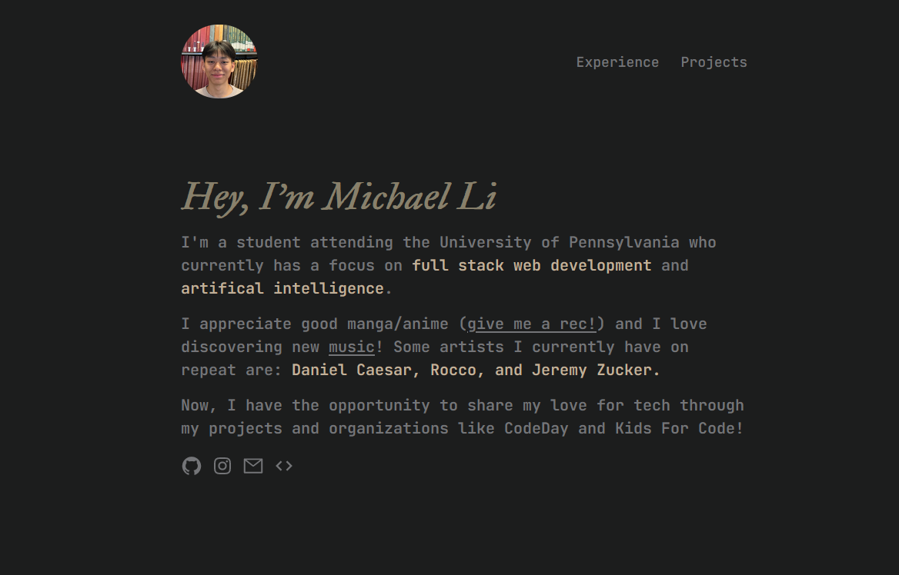

# GRIP-Portfolio
Hi, my name is Michael Li and I am studying Computer Science at the University of Pennsylvania. I love to make new things, especially if it involves contributing back to society and helping others in some way. I've always been passionate about building projects that spark a "WOW" reaction in others and I hope I can continue to do that. 

## [Bentofy Website](https://bentofy.vercel.app/)
Idea: This is a one-stop hub of your own life that you can share with all of those arounds you in the form of the trending Bento UI style. With a multiple variety of cards, you can showcase your hobbies and passions through the photo gallery card, or enlighten everyone with your messages using the text card.
Technologies: React.js, Supabase, TypeScript, Tailwind CSS, Shadcn/ui

Link: [https://bentofy.vercel.app/](https://bentofy.vercel.app/)

## [Spotify Music Box](https://www.itsmichael.dev/projects/musicbox)
Idea: This box will play music with one tap of an album card. If you want to quickly switch from playing Kanye to Taylor Swift, then you can simply tap whichever one of Taylor's albums onto the box and it will begin playing. 
Technologies: Raspberry Pi 4, Python, RFID Tags/Readers, Spotify API

Link: [https://www.itsmichael.dev/projects/musicbox](https://www.itsmichael.dev/projects/musicbox)

## [Portfolio Website](https://www.itsmichael.dev/)
Idea: This website showcases my experiences, skills, and projects as a developer. The website is simple, yet functional on all devices.
Technologies: Next.js, ChakraUI

Link: [https://www.itsmichael.dev/](https://www.itsmichael.dev/)

